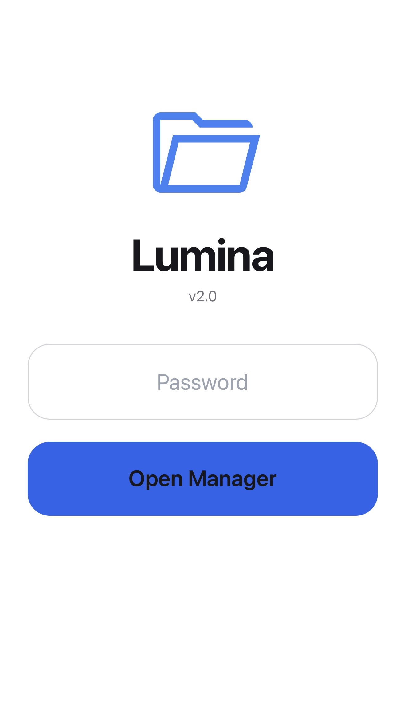

# 🌟 Lumina — Modern PHP File Manager v2.0

  
*(Заміни на своє зображення після публікації)*

> **Сучасний, швидкий і стильний PHP файловий менеджер** з підтримкою **9 мов**, адаптивним світлим дизайном і повною сумісністю з мобільними пристроями (iPhone, Android, планшети).  
> Працює **без бази даних** — просто завантаж один файл!

---

## ✨ Основні можливості

| Функція                      | Статус     | Опис |
|-----------------------------|------------|------|
| 📁 Перегляд папок і файлів   | ✅ Готово   | Сортування за типом і іменем |
| ✏️ Вбудований редактор       | ✅ Готово   | Підсвітка, копіювання/вирізання/вставка |
| 📤 Завантаження файлів       | ✅ Готово   | Підтримка кількох файлів одночасно |
| 🗑️ Видалення (множинне)     | ✅ Готово   | Видалення папок і файлів одним кліком |
| 📂 Створення папок/файлів    | ✅ Готово   | Швидке створення через кнопку |
| 🔄 Перейменування            | ✅ Готово   | Прямо в інтерфейсі |
| 🌍 9 мов інтерфейсу          | ✅ Готово   | Українська + 8 інших |
| 📱 Повністю адаптивний       | ✅ Готово   | iPhone 16 Pro Max, Android, десктоп |
| 🔐 Захист паролем            | ✅ Готово   | За замовчуванням: `admin123` |
| 💾 Відображення місця на диску | ✅ Готово | У реальному часі |
| ⚡ Швидкий AJAX              | ✅ Готово   | Без перезавантаження сторінки |

---

## 🖼️ Скріншоти

  
  
  

*(Додай свої реальні скріншоти після публікації)*

---

## 🚀 Встановлення (3 хвилини)

1. Завантаж файл **`index.php`** у будь-яку папку на сервері
2. Відкрий його в браузері
3. Введи пароль: **`admin123`**
4. Готово! Менеджер працює одразу

**Підтримувані версії PHP:** 7.4 і вище  
**Не потрібні:** MySQL, Composer, додаткові розширення

---

## 🔑 Зміна пароля

Відкрий `index.php` і знайди рядок:

```php
$PASSWORD = "admin123";
