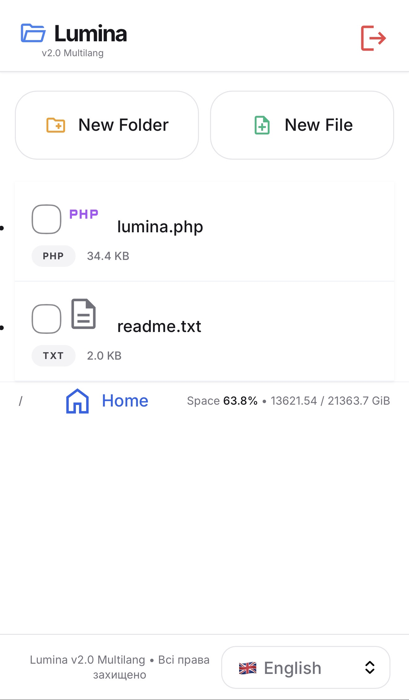
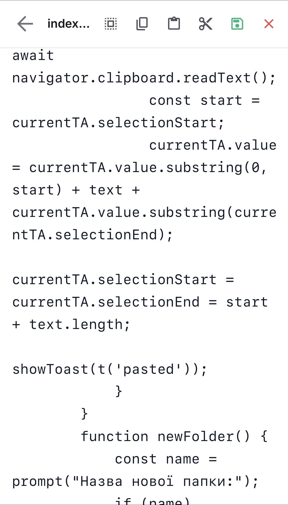

# 🌟 Lumina — Modern PHP File Manager v2.2

> **Сучасний, швидкий і максимально компактний** PHP файловий менеджер з підтримкою **9 мов**, чистим світлим дизайном і повною адаптивністю під мобільні пристрої.  
> Кнопки дій (Нова папка • Новий файл • Завантажити) тепер у шапці **тільки іконками** — максимум місця для списку файлів!

---

## ✨ Основні можливості

| Функція                          | Статус     | Опис |
|----------------------------------|------------|------|
| 📁 Перегляд папок і файлів       | ✅ Готово   | Сортування, іконки, розміри |
| ✏️ Вбудований редактор           | ✅ Готово   | Копіювання, вирізання, вставка |
| 📤 Завантаження файлів           | ✅ Готово   | З галереї, камери, комп’ютера + багатозавантаження |
| 🗑️ Множинне видалення           | ✅ Готово   | Чекбокси + масове видалення |
| 📂 Створення папок і файлів      | ✅ Готово   | Швидкі кнопки |
| 🔄 Перейменування                | ✅ Готово   | Прямо в інтерфейсі |
| 🌍 9 мов інтерфейсу              | ✅ Готово   | Українська + 8 інших |
| 📱 Максимально адаптивний        | ✅ Готово   | iPhone 16 Pro Max, Android, ПК |
| 🔐 Захист паролем                | ✅ Готово   | За замовчуванням: `admin123` |
| 💾 Відображення місця на диску   | ✅ Готово   | У реальному часі |
| ⚡ Швидкий AJAX                  | ✅ Готово   | Без перезавантажень |
| 🎨 Кнопки тільки іконками        | ✅ Готово   | Нова компактна шапка (v2.2) |

---

## 🖼️ Скріншоти

  
**Екран входу**

  
**Головний список файлів з компактною шапкою**

  
**Вбудований редактор**

*(Заміни зображення на свої реальні файли: `login.jpeg`, `list.jpeg`, `edit.jpeg`)*

---

## 🚀 Встановлення (3 хвилини)

1. Завантаж файл **`index.php`** у будь-яку папку на сервері  
2. Відкрий його в браузері  
3. Введи пароль: **`admin123`**  
4. Готово! Працює одразу на будь-якому пристрої.

**Підтримувані версії PHP:** 7.4 і вище  
**Не потрібні:** MySQL, Composer, розширення

---

## 🔑 Зміна пароля

Відкрий `index.php` і знайди рядок:

```php
$PASSWORD = "admin123";

🌐 Підтримувані мови

🇺🇦 Українська
🇷🇺 Російська
🇬🇧 Англійська
🇩🇪 Німецька
🇵🇱 Польська
🇱🇹 Литовська
🇳🇴 Норвезька
🇸🇪 Шведська
🇬🇪 Грузинська


📋 Системні вимоги

PHP 7.4+
Права на запис у папку (755 або 777)
Будь-який хостинг (Shared, VPS, cPanel)
Працює навіть у підпапках (/admin/, /files/ тощо)


⚠️ Важливо (v2.2)

Кнопки дій перенесені в шапку → максимум місця для списку файлів на телефоні
Зміна мови працює в будь-якій директорії
Завантаження працює з галереї, камери та комп’ютера

📄 Ліцензія

❤️ Підтримка та внесок

Знайшов баг? Відкрий Issue
Хочеш нову функцію? Пиши в Discussions
Сподобався проект? Постав ⭐ зірочку!
